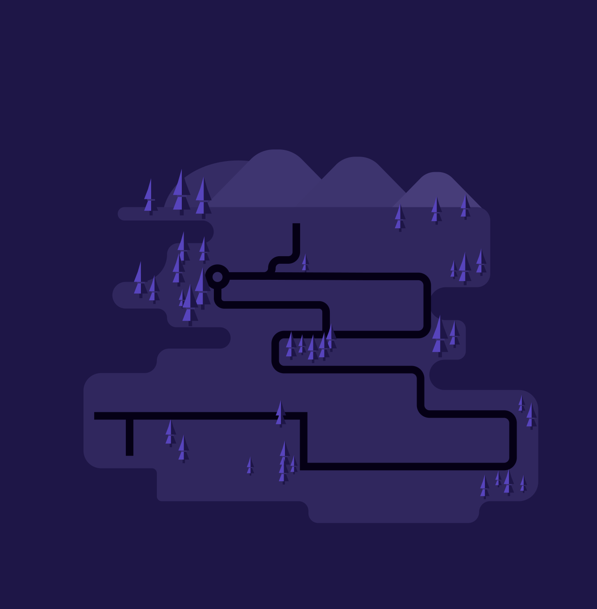
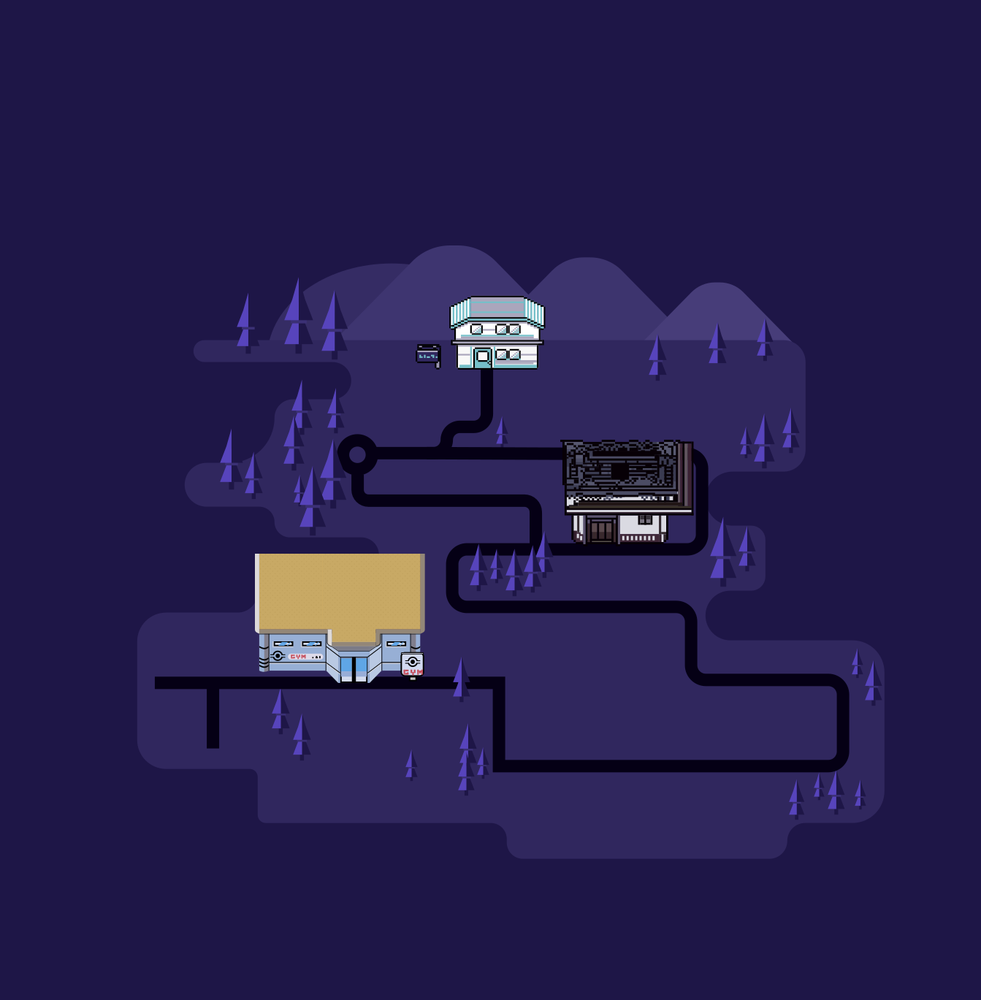
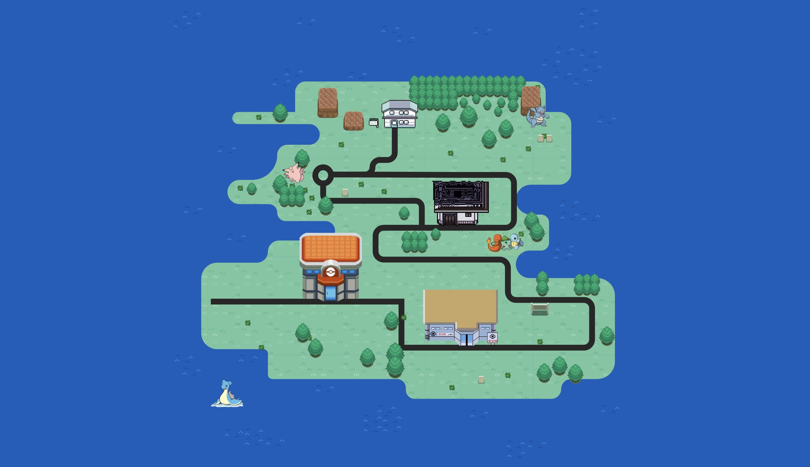

# Procesverslag
Markdown is een simpele manier om HTML te schrijven.  
Markdown cheat cheet: [Hulp bij het schrijven van Markdown](https://github.com/adam-p/markdown-here/wiki/Markdown-Cheatsheet).

Nb. De standaardstructuur en de spartaanse opmaak van de README.md zijn helemaal prima. Het gaat om de inhoud van je procesverslag. Besteedt de tijd voor pracht en praal aan je website.

Nb. Door *open* toe te voegen aan een *details* element kun je deze standaard open zetten. Fijn om dat steeds voor de relevante stuk(ken) te doen.

## Jij

### Ontwerper:
Oscar Stoete

#### Je startniveau:
Mijn startniveau is: Blauw

# Je plan

  
De eerste versie/schets van je ontwerp & je persoonlijke uitdaging

  ### De eerste versie/schets:
  
  
   ### De tweede versie/schets:
  
  
   ### De derde versie/schets:
  

  ### Je ambitie: 
  Aan deze technieken/punten wil ik werken:
  - Mappensysteem om de visuele sfeer van pokemon weer te geven
  - Werken aan mijn css om Deze vaardigheden te verbeteren
  - Ik wil een kleinschalige pokemonbattle weergeven
  - ...
 

## Voortgang/Feedback 1

  
Mijn bevindingen + wijzigingen (minimaal 5)

  ### Bevinding 1:
  De stijl van de map is nog niet helemaal in de stijl van het pokémon genre.
  

  #### oplossing:
  Ik heb de huizen van die op de kaart weergegeven wordt de stijl van de pokemon games gegeven die chronologisch in stijl veranderen op basis van het jaarrtal dat ze     zijn ontworpen.

  ### Bevinding 2:
  Er bevinden nog geen Easter Eggs in het design.

  #### oplossing:
  Ik moet gaan nadenken hoe ik easter eggs ga toepassen in het design, dit heb ik bewaardt voor later.

  ### Bevinding 3:
  De stijl van de map is nog niet helemaal in de stijl van het pokémon genre.
  
    #### oplossing:
  De stijl van de kaart zelf is ook nog niet helemaal in de stijl van Pokémon omdat ik de kleuren van gengagr heb gebruikt. Ik heb dit ook bewaardt voor later om te     bedenken hoe ik de kaart beter in de stijl van pokemon kan bewerken.
  
      ### Bevinding 4:
  hoe ga ik een manier vinden om zoveel mogelijk te laten zien van progressive disclosure zonder te veel informatie te laten zien.
  
    #### oplossing:
   gebouwen veranderen van design stijl door de jaren heen op deze gebouwen kun je klikken en die laten de stijl van dat jaartal zien wanneer de game ontworpen is.
  
    ### Bevinding 5:
  Bedenken hoe ik de kaart responsive ga maken. op het moment is de kaart niet responsive.
  
    #### oplossing:
   -
  

## Voortgang/Feedback 2

  
Mijn bevindingen + wijzigingen (minimaal 5)

  
  ### Bevinding 1:
  Omschrijving van wat er nog niet orde was (tekst en afbeeding(en)).

  #### oplossing:
  Beschrijving hoe je het hebt hebt opgelost of als het niet gelukt is hoe je het zou oplossen (tekst en afbeeding(en)).

  ### Bevinding 2:
  Omschrijving van wat er nog niet orde was (tekst en afbeeding(en)).

  #### oplossing:
  Beschrijving hoe je het hebt hebt opgelost of als het niet gelukt is hoe je het zou oplossen (tekst en afbeeding(en)).

  ### Bevinding 3:
  ...

## Voortgang/Feedback 3

  
Mijn bevindingen + wijzigingen (minimaal 5)

  
  ### Bevinding 1:
  Omschrijving van wat er nog niet orde was (tekst en afbeeding(en)).

  #### oplossing:
  Beschrijving hoe je het hebt hebt opgelost of als het niet gelukt is hoe je het zou oplossen (tekst en afbeeding(en)).

  ### Bevinding 2:
  Omschrijving van wat er nog niet orde was (tekst en afbeeding(en)).

  #### oplossing:
  Beschrijving hoe je het hebt hebt opgelost of als het niet gelukt is hoe je het zou oplossen (tekst en afbeeding(en)).

  ### Bevinding 3:
  ...

## Reflectie

  
Mijn eindresultaat & persoonlijke ontwikkeling

  ### Je uitkomst - karakteristiek screenshot(s):
  

  ### Dit ging goed/Heb ik geleerd: 
  Korte omschrijving met plaatje(s)

  

  ### Dit was lastig/Is niet gelukt:
  Korte omschrijving met plaatje(s)

  

## Bronnenlijst

continu bijhouden terwijl je werkt

Nb. Wees specifiek ('css-tricks' als bron is bijv. niet specifiek genoeg).

1. bron 1
2. bron 2
3. ...

