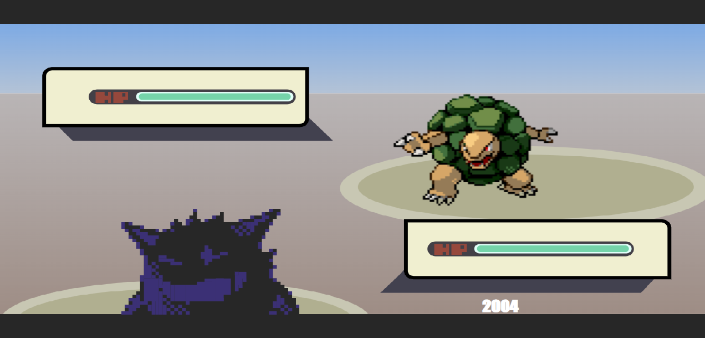

# Procesverslag
Markdown is een simpele manier om HTML te schrijven.  
Markdown cheat cheet: [Hulp bij het schrijven van Markdown](https://github.com/adam-p/markdown-here/wiki/Markdown-Cheatsheet).

Nb. De standaardstructuur en de spartaanse opmaak van de README.md zijn helemaal prima. Het gaat om de inhoud van je procesverslag. Besteedt de tijd voor pracht en praal aan je website.

Nb. Door *open* toe te voegen aan een *details* element kun je deze standaard open zetten. Fijn om dat steeds voor de relevante stuk(ken) te doen.

## Jij

### Ontwerper:
Oscar Stoete

#### Je startniveau:
Mijn startniveau is: Blauw

# Je plan

  
De eerste versie/schets van je ontwerp & je persoonlijke uitdaging

  ### De eerste versie/schets:
  
  
   ### De tweede versie/schets:
  
  
   ### De derde/laatste versie/schets:
  

  ### Je ambitie: 
  Aan deze technieken/punten wil ik werken:
  - Mappensysteem om de visuele sfeer van pokemon weer te geven
  - Werken aan mijn css om Deze vaardigheden te verbeteren
  - Ik wil een kleinschalige pokemonbattle weergeven
  - Ik wil kunnen illustreren
 

## Voortgang/Feedback 1

  
Mijn bevindingen + wijzigingen (minimaal 5)

  ### Bevinding 1:
  De stijl van de map is nog niet helemaal in de stijl van het pokémon genre.
  

  #### oplossing:
  Ik heb de huizen van die op de kaart weergegeven wordt de stijl van de pokemon games gegeven die chronologisch in stijl veranderen op basis van het jaarrtal dat ze     zijn ontworpen.

  ### Bevinding 2:
  Er bevinden nog geen Easter Eggs in het design.

  #### oplossing:
  Ik moet gaan nadenken hoe ik easter eggs ga toepassen in het design, dit heb ik bewaardt voor later.

  ### Bevinding 3:
  De stijl van de map is nog niet helemaal in de stijl van het pokémon genre.
  
    #### oplossing:
  De stijl van de kaart zelf is ook nog niet helemaal in de stijl van Pokémon omdat ik de kleuren van gengagr heb gebruikt. Ik heb dit ook bewaardt voor later om te     bedenken hoe ik de kaart beter in de stijl van pokemon kan bewerken.
  
      ### Bevinding 4:
  hoe ga ik een manier vinden om zoveel mogelijk te laten zien van progressive disclosure zonder te veel informatie te laten zien.
  
    #### oplossing:
   gebouwen veranderen van design stijl door de jaren heen op deze gebouwen kun je klikken en die laten de stijl van dat jaartal zien wanneer de game ontworpen is.
  
    ### Bevinding 5:
  Bedenken hoe ik de kaart responsive ga maken. op het moment is de kaart niet responsive.
  
    #### oplossing:
   -
  

## Voortgang/Feedback 2

  
Mijn bevindingen + wijzigingen (minimaal 5)

  
  ### Bevinding 1:
  weinig contrast map is slecht te zien op sommige schermen.

  #### oplossing:
  Map gaat veranderd worden in de stijl van Pokémon. In de Pokémon spellen word voldoende gebruik gemaakt van goed contrast wat dit probleem gaat anpakken.

  ### Bevinding 2:
  Bronnen opnemen.

  #### oplossing:
  bronen moeten nog worden opgeschreven in de reflectie/code.

  ### Bevinding 3:
  code is rommelig

  #### oplossing:
  code herindelen zodat het makkelijk terug te vinden is.

## Voortgang/Feedback 3

  
Mijn bevindingen + wijzigingen (minimaal 5)

  
  ### Bevinding 1:
  Mist informatieve uitleg.

  #### oplossing:
  dit heb ik gedaan door informatieve uitleg te laten zien met behulp van verschillende easter eggs.

  ### Bevinding 2:
  Probeer gebruik te maken van custom properties waar dat kan.

  #### oplossing:
  Ik heb custom properties gebruikt voor de achtergrond kleur en voor de horizontale en verticale as van de knoppen

  ### Bevinding 3:
  Code nog steeds iets te rommelig.

  #### oplossing:
  heringedeeld, animaties onderaan, knoppen bovenaan, per knop ingedeeld!
  
   ### Bevinding 4:
  Animaties nog niet responsive.

  #### oplossing:
  gedaan door de sections waar de animaties inzitten een 100% height te geven width auto en dan de images die in die sections zitten een viewheight te geven zodat ze     meeschalen met het scherm.

## Reflectie

  
Mijn eindresultaat & persoonlijke ontwikkeling

  ### Je uitkomst - karakteristiek screenshot(s):
  

  ### Dit ging goed/Heb ik geleerd: 
  Ik ben over het algemeen niet goed in het schrijven van code, daarom was dit best wel een lastige opdracht voor mij. Ik heb daarentegen wel een aantal dingen geleerd. Ik heb beter geleerd om gebruik te maken van parents en brothers in de code, die heb ik kunnen gebruiken om zo beter me plaatjes en knoppen aan te kunnen roepen in me code. Daarnaast heb ik ook een aantal dingen geleerd over het schrijven van animaties en ze goed toe te kunnen passen op deze verschillende parents/brothers. 

  

  ### Dit was lastig/Is niet gelukt:
  Als ik meer tijd had gehad had ik 2 dingen meer tijd aan willen besteden:
  1. mooier maken van de pokemon battle/ uitgebreidere animaties
  2. betere detail pagina's waar informatieve uitleg word gegeven.
  
  Met de animaties in het begin heb ik heel erg zitten ''struggelen'' om die juist af te laten spelen maar na hulp, ging dit goed, Alleen had ik graag meer tijd gehad om deze beter uit te werken en of eventueel uitgebreider te maken.
  
  Het laatste waar ik nog erg moete mee heb is om mijn code goed geordend voor mijzelf (en andere) juist neer te zetten waardoor ik het makkelijk terug kan vinden.
  Ik hoop dat dit nu aardig goed terug te lezen zit en heb ik veel gebruik gemaakt van Annotaties

## Bronnenlijst

continu bijhouden terwijl je werkt

Nb. Wees specifiek ('css-tricks' als bron is bijv. niet specifiek genoeg).

1. bron 1
2. bron 2
3. ...

